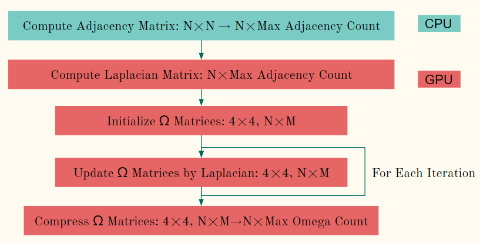
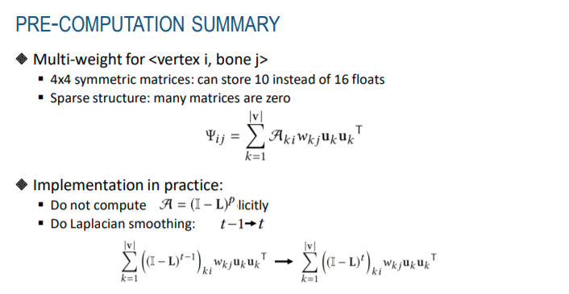
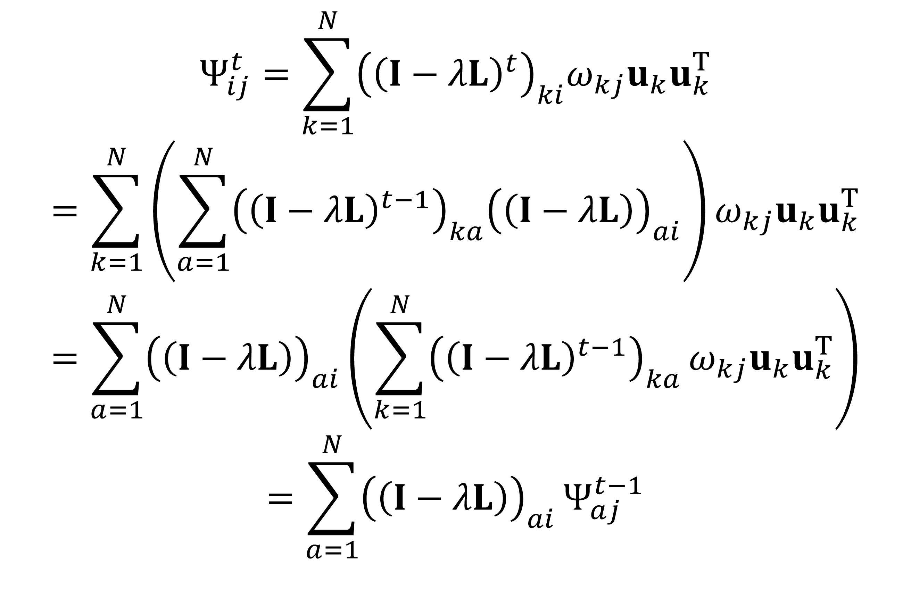
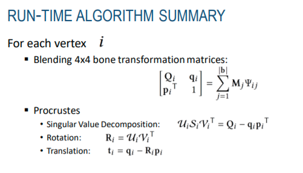

# Notes

## Technical Notes

### Precomputation

In the original DM, we only need to precompute the "delta", representing the set of the displacement between the rest pose mesh and the smoothed mesh, as known as, the rest pose "mush". However, in the DDM, we should deal with not only smoothing but also the weight matrices or even some other properties that helps to find the direct transformation for each vertex. The [paper](https://www.ea.com/seed/news/siggraph2019-direct-delta-mush) describes the formula of the precomputation in details.

For the variant 0 as the example, we should precompute `4 × 4` matrices `Ω` for singular value decomposition during animation, to get the transformation per vertex. In general, there should be one matrix for each vertex and each bone, which is similar to the bone weights. The precomputation includes several processes. First we compute the adjacency matrix of the mesh with N vertices by triangles, and vertex positions if necessary. Because this matrix is sparse, we can compress it in to `N × MaxAdjacencyCount` matrix. After that, we compute the Laplacian matrix by the adjacency matrix for smoothing, and initialize the `Ω` matrices by vertices. For each smoothing iteration, update the `Ω` matrices by the Laplacian matrix and bone weights. Finally, because there may be many bones for some meshes, and the tensor of the `Ω` matrices is also sparse, we can compress the tensor into `4 × 4 × N × MaxOmegaCount`. 

Refer to the section 3.4 of the [paper](https://www.ea.com/seed/news/siggraph2019-direct-delta-mush), there is a summary of the precomputation with extension. Notice that the formula mentioned in this paper is not so efficient for implementation. The figure below shows another idea of the precomputation. Notice that in the paper, `Ω` is a blended value of `ψ` and another matrix that computed by another Laplacian matrix, so if we want to get the blended `Ω`, we can process the similar computation on these two matrix and simply blend them to get `Ω`. 

Instead of computing the `A` matrix explicitly, we update the `Ω` matrices in each iteration. This process is like a product between an `N × N` sparse matrix and `N × M` sparse matrix, where `M << N`. In practice, we can parallelize this process by `N` vertices, and update the `Ω` matrices by the `MaxAdjacencyCount` Laplacian weights and `M` bone weights. The mathematical principle shows below. 

### Animation

Once we get all the precomputation data, we can get the transformation of each vertex directly. 

The figure above shows the algorithm during the animation of the DDM, which is the variant 0 in the paper. 

