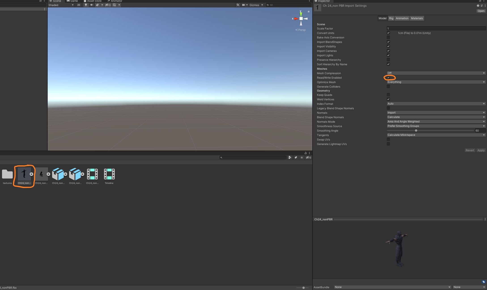
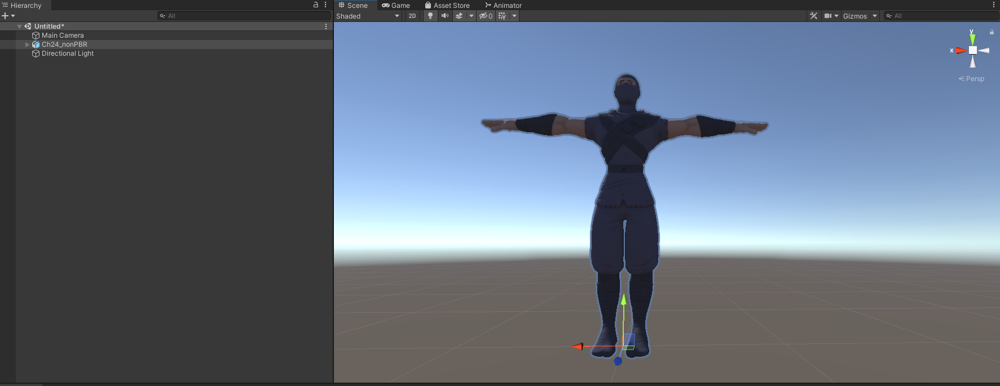
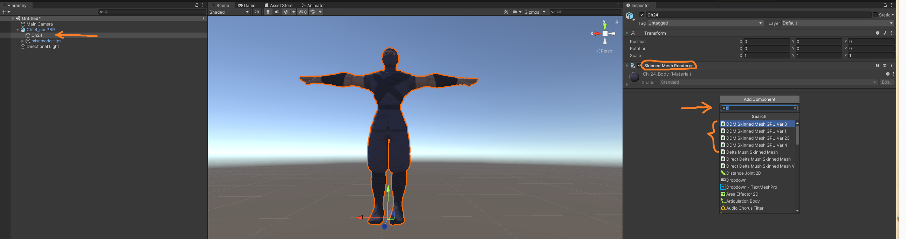
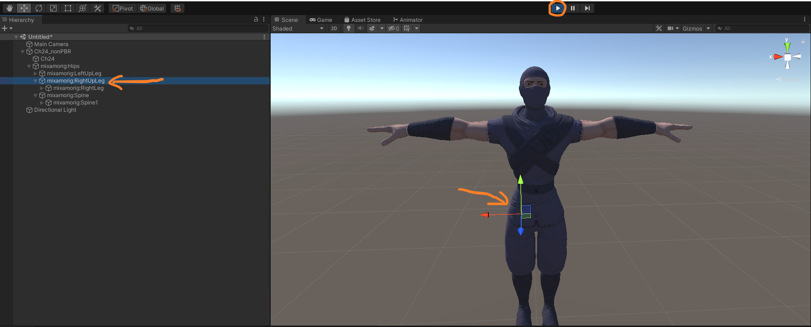
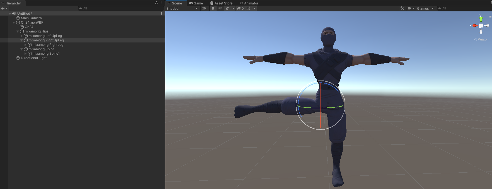
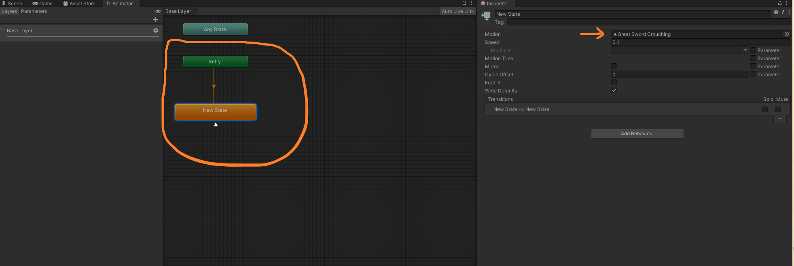
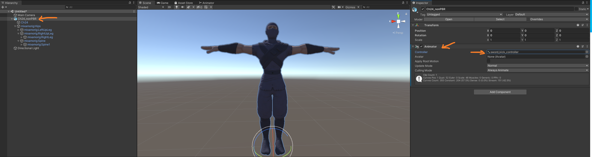

# Real-Time Mesh Skinning with Direct Delta Mush (Unity)

Real-time mesh skinning with DDM implemented in Unity 2020.3.13.

TODO

## How to Build

### Requirement

- Unity 2020.3.13
- Visual Studio 2019

### Build

Add `MeshDeformUnity` to Unity Hub and select unity version. Then you can open this project. 

## Features

- Delta Mush with CPU or GPU.
- Direct Delta Mush with GPU (from variant 0 to variant 5).
- Precomputation of Direct Delta Mush with GPU.

These algorithms aim to do skinning with efficiency, quality and ease of authoring. 

Direct Delta Mush is an algorithm that improves on the efficiency and control of Delta Mush. In brief, the original Delta Mush includes several processes. First in the precomputation step, we smooth the mesh to get the "mush", and compute the "delta" by subtracting the rest pose to the rest pose mush. During the animation, we can use some other method to do skinning, for example, linear blend skinning, to get the deformed mesh and "deformed delta". After that, we do the same smoothing to get the "deformed mush". Finally, we add the "deformed delta" and the "deformed mush" to get the "delta mush" result. 

This kind of methods ease the process of trial-and-error weight painting. However, this iterative computational approach like Delta Mush has prevented direct adoption in real-time engines, even though it has been widely used in modeling tools such as Maya, solving the rig authoring problem. 

DDM turns the iterative algorithm into a direct version, with the same ballpark computational form as some previous geometric weight blending algorithms. In this case, we move many computation into precomputation. Although the precomputation takes longer time to complete compared to the DM, it makes the quality independent of the iteration of smoothing. 

The [paper](https://www.ea.com/seed/news/siggraph2019-direct-delta-mush) also shows some variants which are equivalent to special cases of several previous skinning algorithms. 

TODO

See [technical notes](notes.md) for technical details. 

## How to Use

### 

1. Load models, and toggle `Read/Write Enabled`. 

   

   

   

2. Drag the model into the scene, or select the object with this model in the scene. 

   

   

   

3. Expand and find the mesh object of the model. Add component to the mesh object. Make sure that there is a `Skinned Mesh Render` component in this object. 

   

   

   

4. Take a look at the component `DDM skinned Mesh GPU Var 23` for example. There are several attributes. 

   - `Iterations` represents the iteration count of the precomputation. 
   - `Smooth Lambda` determines the smoothing result for each step. 
   - `Use Compute` determines whether you use GPU skinning or CPU skinning, but currently we only implemented GPU skinning for most of the variants. 
   - `Adjacency Matching Vertex Tolerance` can be set with a small positive float number if you need to merge the adjacency data of the vertices which are very close to each other, but enabling this process may cause longer precomputations.
   -  `Debug Mode` is for comparison to the visual effect of the built-in skinning if you assign `Compare With Linear Blend` to this attribute. 
   - `Compute Shader` determines which compute shader you are using. In most cases, you don't need to modify this attribute, but for `DDM Skinned Mesh GPU Var 23`, you can switch the compute shader between `DirectDeltaMushVar2` and `DirectDeltaMushVar3`. 

   You can modify `Iterations` and `Smooth Lambda` to change the visual effect of the runtime skinning. 

   

   

   

5. Set 30 to the `Iterations`, for example. Then click the `Play` button, and switch to the `Scene` view. Expand the skeleton in the `Hierarchy` window and you can select which joint to edit. 

   

   

   

6. Rotate joints to deform mesh.

   

   

   

7. If you want to play animation on the mesh, you can create an `Animator Controller` and set the animation like the figure below. You can also set the speed as you want. Then choose the root of the model, and add component `Animator`, and set the animator controller mentioned before to the `Controller` attribute. 

   

   

   

   

   After you play, you can see the animation. 

   

## Performance Analysis

### Precomputation

We implemented precomputation in GPU 

TODO

### Animation

TODO

## Credit & Reference

1. [Unity](https://unity.com/)
1. [Math.NET Numerics](https://github.com/mathnet/mathnet-numerics)
1. [Delta Mush: smoothing deformations while preserving detail](https://dl.acm.org/doi/10.1145/2633374.2633376)
1. [Direct Delta Mush Skinning and Variants](https://www.ea.com/seed/news/siggraph2019-direct-delta-mush)

## Presentations

1. [Pitch](https://docs.google.com/presentation/d/1vwb5RJlEHCoQyWLS116C5mvTnZ4lScZMC8LQFr1BcJU/)
2. [Milestone 1](https://docs.google.com/presentation/d/1DddtqMYNPFK_de73_3AZ3dXIFQ1iPYBxOBAKMeCrQ8A/)
3. [Milestone 2](https://docs.google.com/presentation/d/14nwoKlDBEHcIAdbmpu_0bEEPnFItTixbUZDCPtQ1mfM/)
3. [Milestone 3](https://docs.google.com/presentation/d/1FIu6bGBnXOtndSAxtpXztczM1mbGk7st8uuC3rlGfBQ/)
3. [Final]()
3. [Sample Video]()

