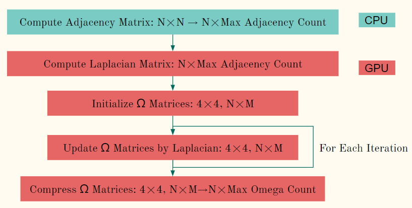

# Real-Time Mesh Skinning with Direct Delta Mush (Unity)

Real-time mesh skinning with DDM implemented in Unity 2020.3.13.

## How To Build

### Requirement

- Unity 2020.3.13
- Visual Studio 2019

### Build

Add `MeshDeformUnity` to Unity Hub and select unity version. Then you can open this project. 

## Features

- Delta Mush with CPU or GPU.
- Direct Delta Mush with GPU (from variant 0 to variant 5).
- Precomputation of Direct Delta Mush with GPU.

These algorithms aim to do skinning with efficiency, quality and ease of authoring.

Direct Delta Mush is an algorithm that improves on the efficiency and control of Delta Mush. In brief, the original Delta Mush includes several processes. First in the precomputation step, we smooth the mesh to get the "mush", and compute the "delta" by subtracting the rest pose to the rest pose mush. During the animation, we can use some other method to do skinning, for example, linear blend skinning, to get the deformed mesh and "deformed delta". After that, we do the same smoothing to get the "deformed mush". Finally, we add the "deformed delta" and the "deformed mush" to get the "delta mush" result. 

DDM turns the iterative algorithm into a direct version, with the same ballpark computational form as some previous geometric weight blending algorithms. In this case, we move many computation into precomputation. Although the precomputation takes longer time to complete compared to the DM, it makes the quality independent of the iteration of smoothing. 

The [paper](https://www.ea.com/seed/news/siggraph2019-direct-delta-mush) also shows some variants which are equivalent to special cases of several previous skinning algorithms. These will be discussed in details later. 

### Precomputation

In the original DM, we only need to precompute the "delta", representing the set of the displacement between the rest pose mesh and the smoothed mesh, as known as, the rest pose "mush". However, in the DDM, we should deal with not only smoothing but also the weight matrices or even some other properties that helps to find the direct transformation for each vertex. The [paper](https://www.ea.com/seed/news/siggraph2019-direct-delta-mush) describes the formula of the precomputation in details.

For the variant 0 as the example, we should precompute `4 × 4` matrices `Ω` for singular value decomposition during animation, to get the transformation per vertex. In general, there should be one matrix for each vertex and each bone, which is similar to the bone weights. The precomputation includes several processes. First we compute the adjacency matrix of the mesh with N vertices by triangles, and vertex positions if necessary. Because this matrix is sparse, we can compress it in to `N × MaxAdjacencyCount` matrix. After that, we compute the Laplacian matrix by the adjacency matrix for smoothing, and initialize the `Ω` matrices by vertices. For each smoothing iteration, update the `Ω` matrices by the Laplacian matrix and bone weights. Finally, because there may be many bones for some meshes, and the tensor of the `Ω` matrices is also sparse, we can compress the tensor into `4 × 4 × N × MaxOmegaCount`. 

Refer to the section 3.4 of the [paper](https://www.ea.com/seed/news/siggraph2019-direct-delta-mush), there is a summary of the precomputation with extension. Notice that the formula mentioned in this paper is not so efficient for implementation. The figure below shows another idea of the precomputation. Notice that in the paper, `Ω` is a blended value of `ψ` and another matrix that computed by another Laplacian matrix, so if we want to get the blended `Ω`, we can process the similar computation on these two matrix and simply blend them to get `Ω`. 

Instead of computing the `A` matrix explicitly, we update the `Ω` matrices in each iteration. This process is like a product between an `N × N` sparse matrix and `N × M` sparse matrix, where `M << N`. In practice, we can parallelize this process by `N` vertices, and update the `Ω` matrices by the `MaxAdjacencyCount` Laplacian weights and `M` bone weights. The mathematical principle shows below. 

### Animation

Once we get all the precomputation data, we can get the transformation of each vertex directly. 

The figure above shows the algorithm during the animation of the DDM, which is the variant 0 in the paper. 

## Performance Analysis

### Precomputation

### Animation

## Credit & Reference

1. [Unity](https://unity.com/)
1. [Math.NET Numerics](https://github.com/mathnet/mathnet-numerics)
1. [Delta Mush: smoothing deformations while preserving detail](https://dl.acm.org/doi/10.1145/2633374.2633376)
1. [Direct Delta Mush Skinning and Variants](https://www.ea.com/seed/news/siggraph2019-direct-delta-mush)

## Presentations

1. [Pitch](https://docs.google.com/presentation/d/1vwb5RJlEHCoQyWLS116C5mvTnZ4lScZMC8LQFr1BcJU/)
2. [Milestone 1](https://docs.google.com/presentation/d/1DddtqMYNPFK_de73_3AZ3dXIFQ1iPYBxOBAKMeCrQ8A/)
3. [Milestone 2](https://docs.google.com/presentation/d/14nwoKlDBEHcIAdbmpu_0bEEPnFItTixbUZDCPtQ1mfM/)
3. [Milestone 3](https://docs.google.com/presentation/d/1FIu6bGBnXOtndSAxtpXztczM1mbGk7st8uuC3rlGfBQ/)
3. [Final]()
3. [Sample Video]()

