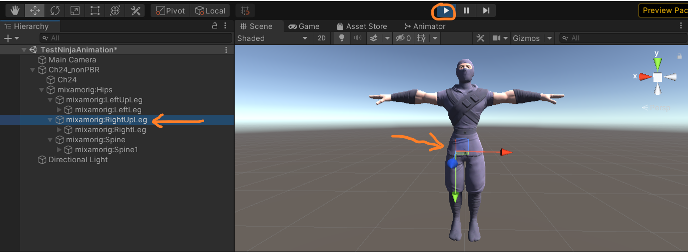
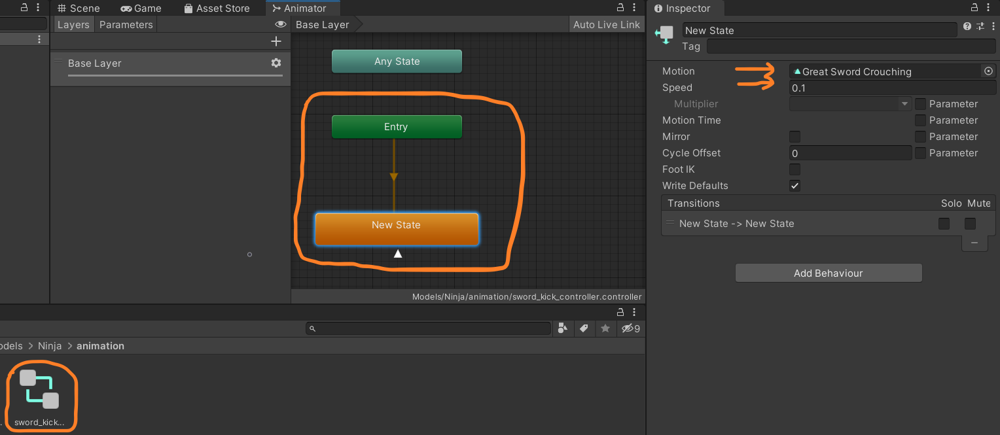

# Real-Time Mesh Skinning with Direct Delta Mush (Unity)

## Project Description
Real-time mesh skinning with DDM implemented in Unity 2020.3.13.

With DDM (left), we get less bulging effect than what we get with built-in skinning (right).
  

We can get smooth skinning result even with rigid binding.
  

## Table of Contents
[Build Instructions](#build-instructions)   
[Features Overview](#overview-features)   
[Usage](#usage)   
[Performance Analysis](#performance-analysis)   
[Future Works](#future-works)   
[Reference](#reference)
[Presentation Slides](#presentation)
[Bloopers](#bloopers)

<a name="build-instructions"/> 

## How to Build

### Requirement

- Unity 2020.3.13
- Visual Studio 2019

### Build

Add `MeshDeformUnity` to Unity Hub and select unity version. Then you can open this project. 

<a name="overview-features"/> 

## Features Overview

- Delta Mush with CPU or GPU.
- Direct Delta Mush with GPU (from variant 0 to variant 5).
- Precomputation of Direct Delta Mush with GPU.

These algorithms aim to do skinning with efficiency, quality and ease of authoring. 

Direct Delta Mush is an algorithm that improves on the efficiency and control of Delta Mush. In brief, the original Delta Mush includes several processes. First in the precomputation step, we smooth the mesh to get the "mush", and compute the "delta" by subtracting the rest pose to the rest pose mush. During the animation, we can use some other method to do skinning, for example, linear blend skinning, to get the deformed mesh and "deformed delta". After that, we do the same smoothing to get the "deformed mush". Finally, we add the "deformed delta" and the "deformed mush" to get the "delta mush" result. 

This kind of methods ease the process of trial-and-error weight painting. However, this iterative computational approach like Delta Mush has prevented direct adoption in real-time engines, even though it has been widely used in modeling tools such as Maya, solving the rig authoring problem. 

DDM turns the iterative algorithm into a direct version, with the same ballpark computational form as some previous geometric weight blending algorithms. In this case, we move many computation into precomputation. Although the precomputation takes longer time to complete compared to the DM, it makes the quality independent of the iteration of smoothing. 

| 0 iter (LBS)                          | 2 iters                               | 4 iters                               | 8 iters                               | 16 iters                               |
| ------------------------------------- | ------------------------------------- | ------------------------------------- | ------------------------------------- | -------------------------------------- |
|  |  |  |  |  |

The table above shows how the number of iterations affect the visual effect of skinning. With more and more iterations, the elbow shows smoother, and less bulging effect. 

The [paper](https://www.ea.com/seed/news/siggraph2019-direct-delta-mush) also shows some variants which are equivalent to special cases of several previous skinning algorithms. 

- The variant 0 is the full DDM model. 
- The variant 1 is an approximation by taking the inverse transpose followed by determinant normalization. The visual effect is equivalent to the implementation of the original DM. However, the rotation matrix is approximated, so the deformation is distorted. 
- The variant 2 and variant 3 use less precomputation data, directly computing the rotation matrix by blending the rotation components of bone transformations, but those representations cannot propagate changes from bone translations to the local skin rotation. For DDM v2, the rotation matrix is blended in quaternion space, and for DDM v3, the rotation is blended in linear space. 
- The variant 4 makes the translation blended directly, based on the variant 2, thus using even less precomputation data. In some cases, it is equal to skinning with optimized centers of rotation (CoR). 
- The practical application of the variant 5 is replacing the skinning weight solver using the original DM as the training data. While we are using the variant 5, we are actually using the linear blend skinning in runtime, so we don't implement the variant 5. 

Keep in mind that using less precomputation data doesn't mean the performance would be improved. 

See [technical notes](notes.md) for technical details. 

<a name="usage"/> 

## How to Use

1. Load models, and toggle `Read/Write Enabled`. 

   

   

   

2. Drag the model into the scene, or select the object with this model in the scene. 

   

   

   

3. Expand and find the mesh object of the model. Add component to the mesh object. Make sure that there is a `Skinned Mesh Render` component in this object. 

   

   

   

4. Take a look at the component `DDM skinned Mesh GPU Var 0` for example. There are several attributes. 

   - `Iterations` represents the iteration count of the precomputation. 
   - `Smooth Lambda` determines the smoothing result for each step. 
   - `Use Compute` determines whether you use GPU skinning or CPU skinning, but currently we only implemented GPU skinning for most of the variants. 
   - `Adjacency Matching Vertex Tolerance` can be set with a small positive float number if you need to merge the adjacency data of the vertices which are very close to each other, but enabling this process may cause longer precomputations.
   -  `Debug Mode` is for comparison to the visual effect of the built-in skinning if you assign `Compare With Linear Blend` to this attribute. 

   You can modify `Iterations` and `Smooth Lambda` to change the visual effect of the runtime skinning. 

   

   

   

5. Set `Iterations` to 30, for example. For this model, set the `Adjacency Matching Vertex Tolerance` to a positive number to enable vertex matching. Then click the `Play` button, and switch to the `Scene` view. Expand the skeleton in the `Hierarchy` window and you can select which joint to edit. 

   

   

   

6. Rotate joints to deform mesh.

   

   

   

7. If you want to play animation on the mesh, you can create an `Animator Controller` and set the animation like the figure below. You can also set the speed as you want. Then choose the root of the model, and add component `Animator`, and set the animator controller mentioned before to the `Controller` attribute. 

   

   

   

   

   After you play, you can see the animation. Some of the models can be found at [mixamo](https://www.mixamo.com/).

<a name="performance-analysis"/> 

## Performance Analysis

### Precomputation

We implemented precomputation of DDM in both CPU and GPU, and compare their performances on Wahoo model with 3809 vertices and 35 bones. Since building the adjacency matrix should be done in CPU, we don't compare this process. 

It can be clearly seen that the GPU implementation significantly improves the performance. The runtime of it grows almost linearly as the number of iterations.

On the other hand, we test the GPU based precomputation on different models, with a larger range of iterations.

The figure above shows a nearly linear relation between iterations and the precomputation time, even on models of different sizes and within a larger iteration range. Also, as the number of vertices in the model becomes larger, the performance drops dramatically.

### Animation

We test the runtime performance of different variants of DDM, as well as the original DM and the built-in linear blend skinning. These are tested with two models: Wahoo with 66654 vertices and 45 bones, and Ninja with 13560 vertices and 52 bones. 

It is clear that even though we only set 10 iterations, the Delta Mush is much costlier than any variants of the Direct Delta Mush. The variants of the DDM performs different, with v0, v1, and v4 faster than v2 and v3. The built-in linear blend skinning is the fastest, which is very straightforward and reasonable. 

The presented results may include significant overhead that would need to be investigated with low-level programming, as the [paper](https://www.ea.com/seed/news/siggraph2019-direct-delta-mush) says in section 4, so they might be much faster if we carefully optimize v2, v3, and v4. 

<a name="future-works"/> 

## Future Works

- Implement different Laplacian matrix.
- Refer to [the next paper]((https://www.ea.com/seed/news/ddm-compression-with-continuous-examples)).
- Support more models and scaling.

<a name="reference"/> 

## Credit & Reference

1. [Unity](https://unity.com/)
1. [Math.NET Numerics](https://github.com/mathnet/mathnet-numerics)
1. [Delta Mush: smoothing deformations while preserving detail](https://dl.acm.org/doi/10.1145/2633374.2633376)
1. [Direct Delta Mush Skinning and Variants](https://www.ea.com/seed/news/siggraph2019-direct-delta-mush)
1. [Direct Delta Mush Skinning Compression with Continuous Examples](https://www.ea.com/seed/news/ddm-compression-with-continuous-examples)
1. [mixamo](https://www.mixamo.com/)

<a name="presentations"/> 

## Presentations

1. [Pitch](https://docs.google.com/presentation/d/1vwb5RJlEHCoQyWLS116C5mvTnZ4lScZMC8LQFr1BcJU/)
2. [Milestone 1](https://docs.google.com/presentation/d/1DddtqMYNPFK_de73_3AZ3dXIFQ1iPYBxOBAKMeCrQ8A/)
3. [Milestone 2](https://docs.google.com/presentation/d/14nwoKlDBEHcIAdbmpu_0bEEPnFItTixbUZDCPtQ1mfM/)
3. [Milestone 3](https://docs.google.com/presentation/d/1FIu6bGBnXOtndSAxtpXztczM1mbGk7st8uuC3rlGfBQ/)
3. [Final Presentation](https://docs.google.com/presentation/d/1wim-hyjRPX4jIR6AkHR4tgXh2nGj3MpmaegtT0uUxrw/)
3. [Sample Video]()

<a name="bloopers"/> 

## Bloopers

